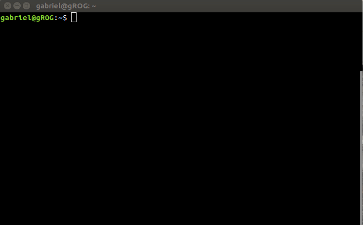

# dog

Do you know the unix ```cat``` command? Well... I like dogs... 🐶



### Installation

just run the ```install.sh``` as ```sudo``` 😉

### Usage

```dog [file]```

### License

dog was created by [Gabriel Polastrini](https://gabrielpolastrini.com). Released under the GPL v3 license.
